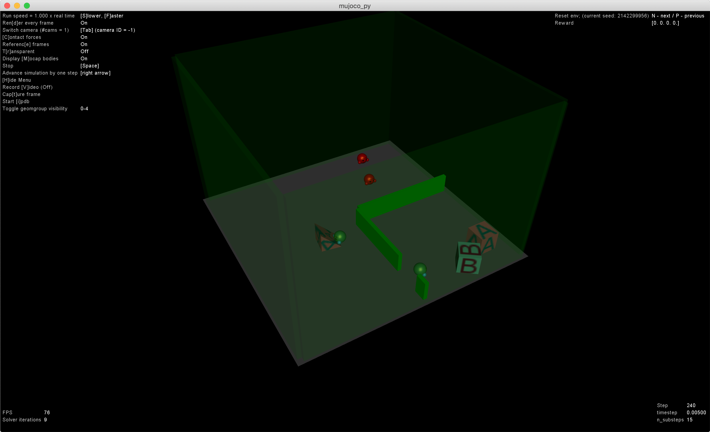
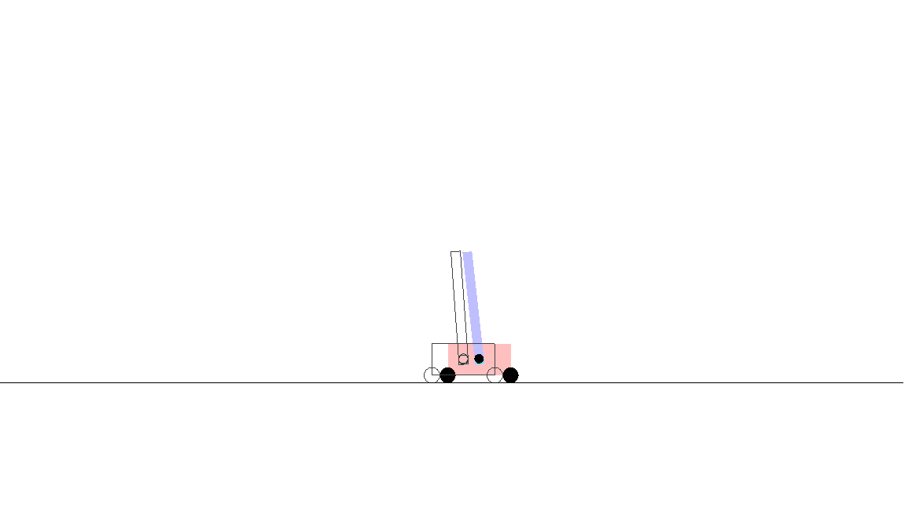
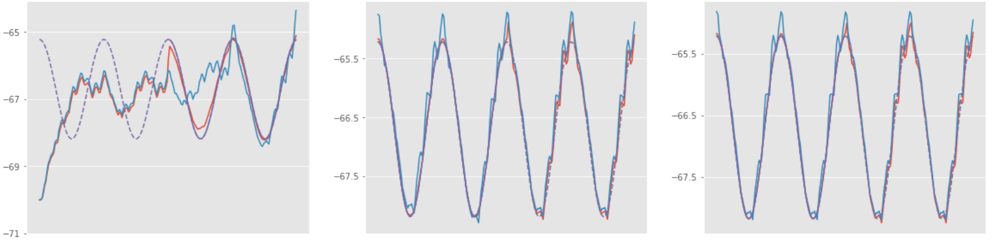

# Evolution and AI

**This repo is now work in progress**

Materials for the lecture ["Evolution and AI"](https://do2dle.connpass.com/event/161217/)

## Papers

We are going to discuss on the papers below. To disucuss on these papers, we prepared the refactored code of these paprers in this repo.

### Emergent Tool Use From Multi-Agent Autocurricula (by OpenAI)

[paper](https://arxiv.org/abs/1909.07528)

### Learning to Predict Without Looking Ahead: World Models Without Forward Prediction (by Google Brain)

[paper](https://arxiv.org/abs/1910.13038)

###  Learning by the Dendritic Prediction of Somatic Spiking

[paper](https://core.ac.uk/download/pdf/82249279.pdf)

