# Evolution and AI

**This repo is now work in progress**

Materials for the lecture ["Evolution and AI"](https://do2dle.connpass.com/event/161217/)

## Papers

We are going to discuss on the papers below. To disucuss on these papers, I prepared the refactored code of these paprers in this repo. (For the papers without the reference code, I prepared my own impelemtation.)

### Emergent Tool Use From Multi-Agent Autocurricula (by OpenAI)

[paper](https://arxiv.org/abs/1909.07528) / [code](multi_agent_emergence)

### Learning to Predict Without Looking Ahead: World Models Without Forward Prediction (by Google Brain)

[paper](https://arxiv.org/abs/1910.13038) / [code](learntopredict)

###  Learning by the Dendritic Prediction of Somatic Spiking (Urbanczik and Senn)

[paper](https://core.ac.uk/download/pdf/82249279.pdf) / [code](dendritic_prediction)

### Predictive coding in the visual cortex: a functional interpretation of some extra-classical receptive-field effects (Rao and Ballard)

[paper](https://www.researchgate.net/publication/13103385_Predictive_Coding_in_the_Visual_Cortex_a_Functional_Interpretation_of_Some_Extra-classical_Receptive-field_Effects) / [code](predictive_coding)

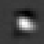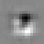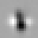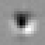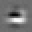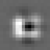

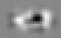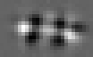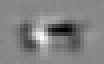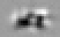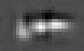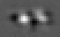
