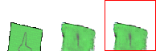

# VAE Racing

Refactored version of the original implementation.

(Most of the code is based on the Google Brain's [original version](https://github.com/google/brain-tokyo-workshop
))


## Running pre-trained models:

The following command loads an agent trained to drive around the track from pixels (via VAE) with 30 percent peek probability:

```
python model.py learn_vae_racing log/learn_vae_racing.cma.4.64.best.json
```

## Results


input imge, decoded image, predicted image