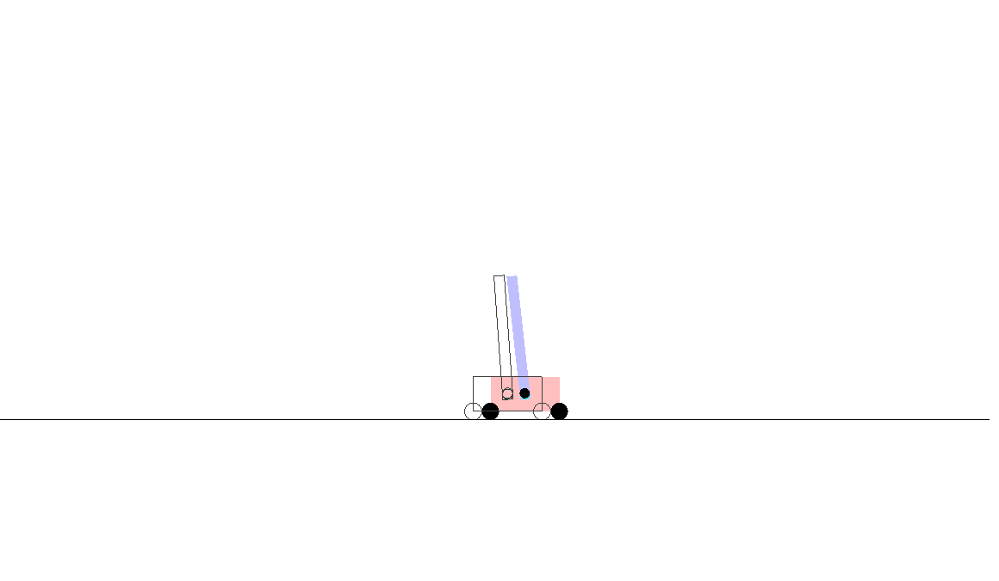

# Cartpole



Refactored version of the original implementation.

(Most of the code is based on the Google Brain's [original version](https://github.com/google/brain-tokyo-workshop
))


# run pre-trained models:

```
$ python3 model.py learn_cartpole log/learn_cartpole.pepg.16.384.best.json
```
