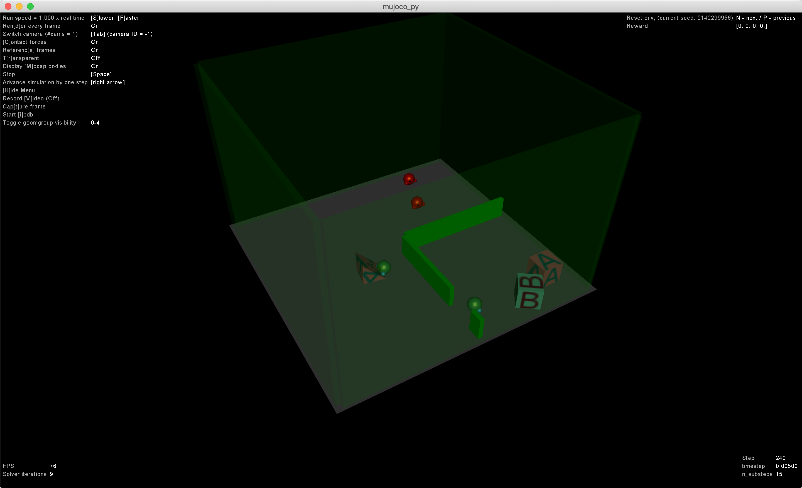

# Multiagent emergence environments



Most of the code in this repo is based on OpenAI's original impelemtation.

* [Emergent Tool Use From Multi-Agent Autocurricula](https://github.com/openai/multi-agent-emergence-environments)
* [Worldgen: Randomized MuJoCo environments](https://github.com/openai/mujoco-worldgen)


## How to run (for MacOSX)

### Setup and install Mujoco

If you don't have Mujoc license, you need to use Mujoco 30-day trial license.

[https://www.roboti.us/license.html](https://www.roboti.us/license.html)

First download `getos_osx` tool and run it to get

```
$ chmod u+x getid_osx
$ ./getid_osx

Your MuJoCo computer id is:

   OSX_*************************

Please send this string to Roboti LLC to generate activation key.
```

Then use this id for the trial license request form. Then you will receive `mjkey.txt` file.
Download mujoco version 1.5 files (`mjpro150 osx`) from [here](https://www.roboti.us/index.html).

Locate both `mkey.txt` file and extracted `mjpro150` folder into `~/.mujoco`

```
$ ls ~/.mujoco
mjkey.txt	mjpro150
```

## Prepare libraries

```
pip3 install -r requirements.txt
```

## How to show result

You can show trained result like,

```
$ export PYTHONPATH=.
$ python3 bin/examine.py examples/hide_and_seek_quadrant.jsonnet examples/hide_and_seek_quadrant.npz
```
